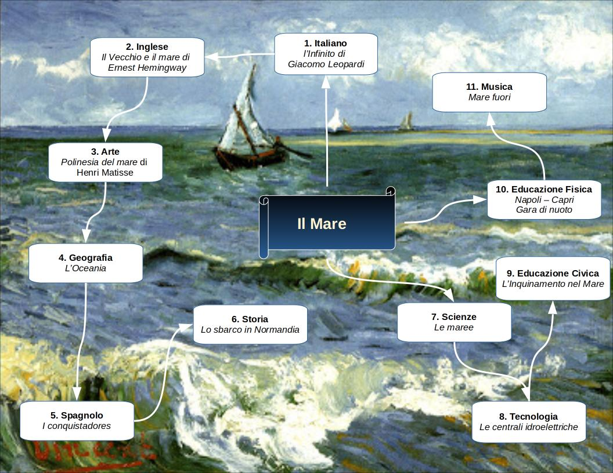

=======
Il Mare
=======

Oggi vi presenterò la mia tesina che parla del **Mare** e di tutto ciò che lo compone.

Ho scelto quest’argomento perché fin da piccola sono stata affascinata dall'immensità del mare e da tutte le creature che lo vivono.

**Mappa Concettuale**

.. toctree::
   :maxdepth: -1

   scienze
   musica
   arte
   storia
   spagnolo
   letteratura
   inglese
   geografia
   scienze_motorie
   tecnologia
   cittadinanza_costituzione
   religione
